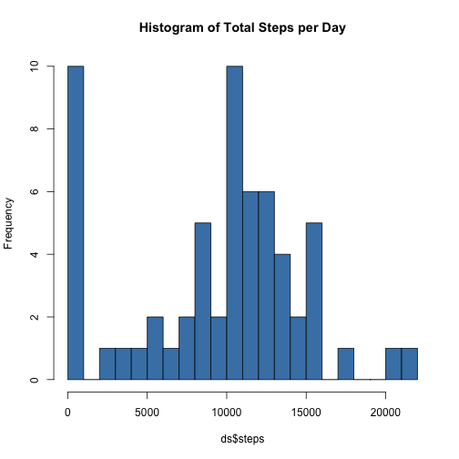
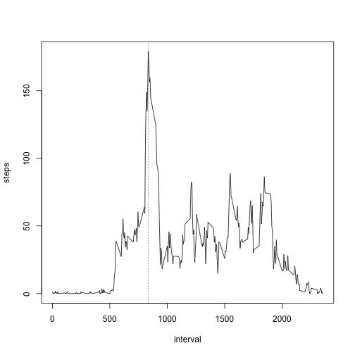
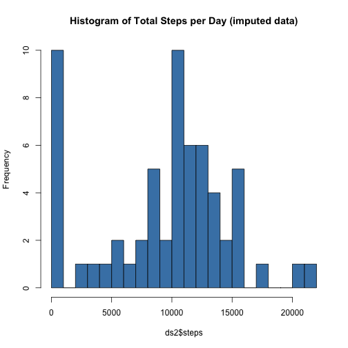
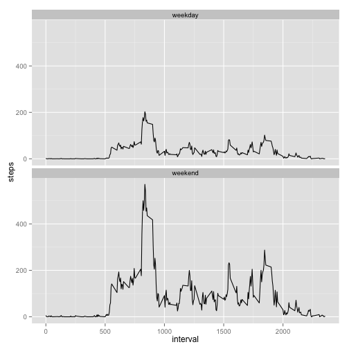

```r
library(dplyr)
```

```
## Warning: package 'dplyr' was built under R version 3.1.3
```

```
## 
## Attaching package: 'dplyr'
## 
## The following objects are masked from 'package:stats':
## 
##     filter, lag
## 
## The following objects are masked from 'package:base':
## 
##     intersect, setdiff, setequal, union
```

```r
library(ggplot2)
```

```
## Warning: package 'ggplot2' was built under R version 3.1.3
```

## Loading and preprocessing the data

```r
unzip("activity.zip")
d <- read.csv("activity.csv")
d$date <- as.Date(d$date)
head(d)
```

```
##   steps       date interval
## 1    NA 2012-10-01        0
## 2    NA 2012-10-01        5
## 3    NA 2012-10-01       10
## 4    NA 2012-10-01       15
## 5    NA 2012-10-01       20
## 6    NA 2012-10-01       25
```

## What is mean total number of steps taken per day?

```r
ds <- group_by(d,date) %>% summarize(steps=sum(steps,na.rm=T))
head(ds)
```

```
## Source: local data frame [6 x 2]
## 
##         date steps
## 1 2012-10-01     0
## 2 2012-10-02   126
## 3 2012-10-03 11352
## 4 2012-10-04 12116
## 5 2012-10-05 13294
## 6 2012-10-06 15420
```

```r
hist(ds$steps,breaks=20,col="steelblue",main="Histogram of Total Steps per Day")
```

 


```r
# mean steps per day
meansteps <- mean(ds$steps)
meansteps
```

```
## [1] 9354.23
```

```r
# median steps per day
mediansteps <- quantile(ds$steps,0.5)
mediansteps
```

```
##   50% 
## 10395
```


## What is the average daily activity pattern?

```r
ndays <- nrow(ds) # ds is already summarized to one obs per day
di <- group_by(d,interval) %>% summarize(steps=sum(steps,na.rm=T)/ndays)
head(di)
```

```
## Source: local data frame [6 x 2]
## 
##   interval      steps
## 1        0 1.49180328
## 2        5 0.29508197
## 3       10 0.11475410
## 4       15 0.13114754
## 5       20 0.06557377
## 6       25 1.81967213
```

```r
dimax <- filter(di,steps == max(di$steps))
# interval with max average steps
max.steps.interval <- dimax$interval
max.steps.interval
```

```
## [1] 835
```

```r
# plot w/ vertical line at max steps
plot(di$steps ~ di$interval,type="l",xlab="interval",ylab="steps")
abline(v=max.steps.interval,lty=3)
```

 

## Imputing missing values  
strategy: replace missing values with mean for that interval

```r
# copy of original data frame
d2 <- d

for (i in 1:nrow(d)) {
    # Check for NA
    if (is.na(d$steps[i])) {
        # look up mean for that interval 
        d2$steps[i] <- as.numeric(filter(di,interval==5) %>% select(steps))
    }
}
head(d2)
```

```
##      steps       date interval
## 1 0.295082 2012-10-01        0
## 2 0.295082 2012-10-01        5
## 3 0.295082 2012-10-01       10
## 4 0.295082 2012-10-01       15
## 5 0.295082 2012-10-01       20
## 6 0.295082 2012-10-01       25
```

```r
ds2 <- group_by(d,date) %>% summarize(steps=sum(steps,na.rm=T))
# mean daily steps for imputed data frame
meansteps2 <- mean(ds2$steps)
meansteps2
```

```
## [1] 9354.23
```

```r
# median steps for imputed data
mediansteps2 <- quantile(ds2$steps,0.5)
mediansteps2
```

```
##   50% 
## 10395
```

```r
# % change to mean by imputation:
(meansteps2 - meansteps) / meansteps * 100
```

```
## [1] 0
```

```r
# % change to median by imputation:
(mediansteps2 - mediansteps) / mediansteps * 100
```

```
## 50% 
##   0
```


```r
hist(ds2$steps,breaks=20,col="steelblue",main="Histogram of Total Steps per Day (imputed data)")
```

 


## Are there differences in activity patterns between weekdays and weekends?


```r
# make logical index vector, TRUE means weekend
wkd <- weekdays(d$date) == "Saturday" | weekdays(d$date) == "Sunday"
# convert booleans to labels
wkd[wkd == T] <- "weekend"
wkd[wkd == F] <- "weekday"
# add factor to data frame
d$daytype <- factor(wkd)

# count weekdays and weekends in data set for mean calculations
nweekdays <- sum(weekdays(ds$date) != "Saturday" & weekdays(ds$date) != "Sunday")
nweekends <- sum(weekdays(ds$date) == "Saturday" | weekdays(ds$date) == "Sunday")

# separate weekday data frame w/ means
dweekday <- filter(d,daytype=="weekday") %>% 
        group_by(interval) %>% 
        summarize(steps=sum(steps,na.rm=T)/nweekdays) 
dweekday$daytype <- rep("weekday",nrow(dweekday))

# separate weekend data frame w/ means
dweekend <- filter(d,daytype=="weekday") %>% 
        group_by(interval) %>% 
        summarize(steps=sum(steps,na.rm=T)/nweekends) 
dweekend$daytype <- rep("weekend",nrow(dweekend))

# combine back into one data frame
dwkd <- rbind(dweekday,dweekend)
# re-convert daytype to factor
dwkd$daytype <- factor(dwkd$daytype)

# panel plot
p <- ggplot(dwkd, aes(interval,steps)) + geom_line() + facet_wrap(~daytype, ncol=1)
print(p)
```

 

